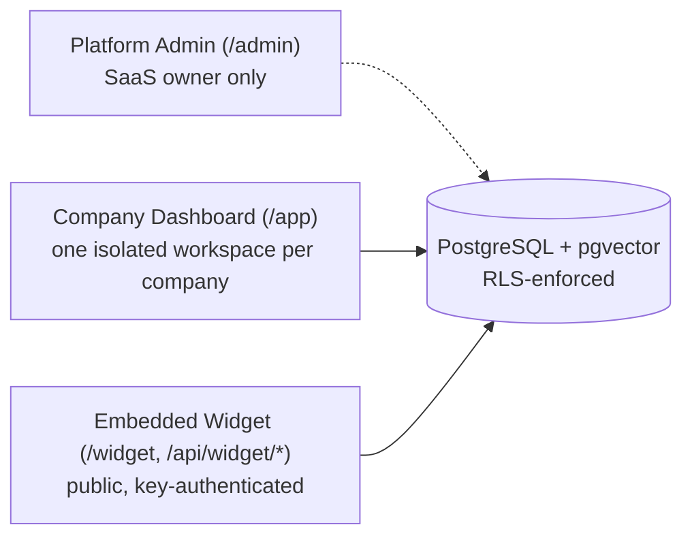

<p align="center">
  
</p>

<h1 align="center">AI Lead Agent</h1>

<p align="center">
  An enterprise-grade, multi-tenant AI Lead Engagement Platform — deployed in production as <strong>Bloom</strong>.<br/>
  Capture, qualify, and convert website visitors with an AI chat widget grounded in each company's own knowledge base.
</p>

<p align="center">
  <a href="./docs/README.md">Documentation</a> ·
  <a href="./docs/getting-started/README.md">Getting Started</a> ·
  <a href="./docs/api/README.md">API Reference</a> ·
  <a href="./docs/architecture/README.md">Architecture</a> ·
  <a href="./CONTRIBUTING.md">Contributing</a>
</p>

---

## Overview

AI Lead Agent lets a company embed an AI chat widget on their own website. The assistant answers visitor questions grounded entirely in that company's own knowledge base (uploaded documents, imported pages, or pasted text) — never inventing prices, offers, or policies — and captures structured lead information along the way. When the AI can't help, or an agent wants to step in, a human takeover flow hands the conversation to a real person without the visitor losing context.

Every company's data — knowledge base, conversations, leads, AI configuration — is isolated from every other company's, enforced at two independent layers: application-level scoping and PostgreSQL Row-Level Security. See [`CLAUDE.md`](./CLAUDE.md) for the full, permanent set of architecture and security rules this codebase is built against.

## Features

- **Embeddable AI chat widget** — a two-line install snippet, fully themeable, domain-allowlisted, rate-limited
- **Knowledge Base** — PDF/DOCX/website/text import, automatic chunking + embedding + semantic search (pgvector)
- **Configurable AI behaviour** — structured configuration (never a raw prompt textarea) covering identity, personality, business hours, business rules, lead-qualification questions, and multi-provider support (Claude, OpenAI, Gemini, Llama-compatible)
- **Conversation Engine** — streaming AI replies, citation tracking, automatic escalation to a human after a configurable number of AI attempts
- **Lead Management** — kanban/table pipeline, AI-generated lead summaries and scoring, tagging, notes, assignment, CSV export
- **Human Inbox** — manual or automatic takeover, reply as a human, resume the AI
- **Analytics** — 7 aggregation domains, alert rules, customizable dashboard, CSV/JSON export
- **Platform Admin** — cross-tenant company management, first-owner invitations, platform-wide audit log
- **Multi-tenant by construction** — every tenant table carries `organization_id` and Postgres RLS, enforced at both layers, never one or the other

## Architecture

Three separate application surfaces, one modular-monolith Next.js codebase:



Full diagrams (system architecture, database ER, auth flow, conversation pipeline, widget flow) live in [`docs/architecture/`](./docs/architecture/README.md).

## Tech stack

Next.js 16 (App Router, Turbopack, React 19) · TypeScript (strict) · Tailwind CSS v4 + shadcn/ui · Supabase (Postgres, Auth, Storage) · pgvector · Drizzle ORM · Zod · Inngest · Claude / OpenAI / Gemini / Llama-compatible · Voyage AI embeddings · Sentry · pnpm.

## Quick start

```bash
pnpm install
cp .env.example .env.local   # fill in Supabase + app URL — see docs
pnpm db:migrate
pnpm dev
```

Full setup — including creating a Supabase project, the platform-admin bootstrap step, and environment variable reference — is in [**Getting Started**](./docs/getting-started/README.md).

## Documentation

| | |
|---|---|
| [Getting Started](./docs/getting-started/README.md) | Local setup, environment variables |
| [Architecture](./docs/architecture/README.md) | System design, diagrams, request lifecycles |
| [Database](./docs/database/README.md) | Schema, ER diagram, RLS, migrations |
| [Authentication](./docs/authentication/README.md) · [Authorization](./docs/authorization/README.md) | Session model, roles & permissions |
| [API Reference](./docs/api/README.md) | Every endpoint — auth, request/response, errors |
| [AI](./docs/ai/README.md) · [Knowledge Base](./docs/knowledge-base/README.md) | Providers, prompt assembly, retrieval, embeddings |
| [Widget](./docs/widget/README.md) | Installation, configuration, security |
| [Deployment](./docs/deployment/README.md) · [Operations](./docs/operations/README.md) | Vercel/Supabase/Inngest, monitoring, incident response |
| [Testing](./docs/testing/README.md) | Test strategy, cross-tenant isolation suite |
| [Troubleshooting](./docs/troubleshooting/README.md) | Common issues and fixes |
| [Security](./docs/security/README.md) | Security model, audit logs |

Full index: [`docs/README.md`](./docs/README.md).

## Deployment

Deployed on Vercel with Supabase (Postgres/Auth/Storage) and Inngest (background jobs). See [`DEPLOYMENT.md`](./DEPLOYMENT.md) for the production checklist and [`docs/deployment/README.md`](./docs/deployment/README.md) for full detail.

## Contributing

See [`CONTRIBUTING.md`](./CONTRIBUTING.md) for coding standards, git workflow, and the PR checklist. Security issues: see [`SECURITY.md`](./SECURITY.md).

## Working title note

"AI Lead Agent" is the working/repo name established in [`CLAUDE.md`](./CLAUDE.md), the project's permanent architecture reference. The current production deployment is branded **Bloom** / **BloomAI**. Both names refer to the same codebase.

## License

Private repository. All rights reserved.
