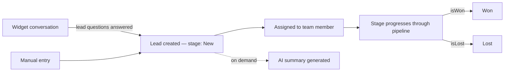

# Leads

## Purpose

Captures, qualifies, and tracks prospective customers through a pipeline. A lead can be created automatically from a widget conversation (when the AI's configured [lead-qualification questions](../ai/README.md#ai-behaviour-module) are answered) or manually by a company user.

## Features

- Kanban board (by stage) and table views
- AI-generated lead summaries (whoIsThisPerson, whatDoTheyNeed, budget/timeline, pain points, products discussed, recommended next action, four 0–100 scores) — see [AI-generated summaries](#ai-generated-summaries) below
- Custom, reorderable pipeline stages, with `isWon`/`isLost` markers
- Tags and internal notes (never visitor-visible)
- Assignment to a team member, with full reassignment history
- Full activity timeline unifying stage changes, notes, tags, scores, and assignments
- CSV export

## Roles

| Role | Access |
|---|---|
| `owner`, `admin` | Full CRUD, assignment, stage management |
| `manager` | View, create, update, assign — no delete |
| `agent` | View/update only leads unassigned or assigned to them (service-layer restriction, not a separate role permission) |
| `viewer` | Read-only |

Permissions: `leads.view`, `leads.create`, `leads.update`, `leads.delete`, `leads.assign`. See [Authorization](../authorization/README.md) for the full role/permission matrix.

## Workflow

Default stages (lazily created on first access per organization): New, Qualified, Contacted, Meeting Scheduled, Proposal Sent, Won, Lost, Archived.

## Screens

- `/app/leads` — kanban/table toggle, filters (stage, priority, assignee, source, tag, score, date range)
- `/app/leads/[leadId]` — detail page: contact info, AI summary, activity timeline, notes, tags

## Database tables

`lead_stages`, `leads`, `lead_tags`, `lead_notes`, `lead_assignments` (append-only), `lead_stage_history` (append-only), `lead_scores` (append-only), `lead_activity` (append-only unified feed). Full column definitions: [Database → Leads](../database/README.md#leads).

## AI-generated summaries

`POST /api/leads/:leadId/summary` sends the lead's full conversation transcript to the organization's configured AI provider and asks for structured JSON: `whoIsThisPerson`, `whatDoTheyNeed`, `budget`, `timeline`, `painPoints[]`, `productsDiscussed[]`, `recommendedNextAction`, plus four 0–100 scores (`intentScore`, `urgencyScore`, `buyingSignalsScore`, `supportSignalsScore`) and `budgetMentioned`. The lead's numeric `score` is recomputed from these signals. Fails with `400` if the lead has no conversation, or if the provider doesn't return valid structured JSON.

## API reference

### `GET /api/leads`
Permission: `leads.view`. Query (`leadSearchQuerySchema`): `q, stageId, priority, assignedUserId, source, widgetId, tag, minScore, createdAfter, createdBefore, limit`. Response `200`: `{ leads: Lead[] }`.

### `POST /api/leads`
Permission: `leads.create`. Body (`createLeadSchema`). Response `201`: `{ lead }`.

### `GET /api/leads/:leadId`
Permission: `leads.view`. `404 { error: "Lead not found" }` if missing or (for `agent`) not visible.

### `PATCH /api/leads/:leadId`
Permission: `leads.update`. Body: `name?, email?, phone?, company?, location?, priority?, scoreAdjustment?`. Response `200`: `{ lead }`.

### `DELETE /api/leads/:leadId`
Permission: `leads.delete`. **Hard delete** — leads are the one exception to this app's general soft-delete convention for tenant assets. `204`.

### `PATCH /api/leads/:leadId/assign`
Permission: `leads.assign`. Body: `{ userId: uuid | null }`. Response `200`: `{ lead }`.

### `GET /api/leads/:leadId/notes` · `POST /api/leads/:leadId/notes`
Permission: `leads.view` (GET) / `leads.update` (POST). `POST` body: `{ content: string (1–5000 chars) }` → `201 { note }`. Note content is never written to the audit log — only the `noteId`.

### `DELETE /api/leads/:leadId/notes/:noteId`
Permission: `leads.update`. `404 { error: "Note not found" }` if already gone. `204`.

### `PATCH /api/leads/:leadId/stage`
Permission: `leads.update`. Body: `{ stageId: uuid }`. `404 { error: "Stage not found" }` if the stage doesn't belong to the org. Records a `lead_stage_history` row. Response `200`: `{ lead }`.

### `POST /api/leads/:leadId/summary`
Permission: `leads.update`. No body. See [AI-generated summaries](#ai-generated-summaries). Response `200`: `{ lead }` (updated).

### `GET /api/leads/:leadId/tags` · `POST /api/leads/:leadId/tags`
Permission: `leads.view` (GET) / `leads.update` (POST). `POST` body: `{ tag: string (1–40 chars) }`; `400 { error: "Tag already exists on this lead" }` on duplicate. `201 { tag }`.

### `DELETE /api/leads/:leadId/tags/:tagId`
Permission: `leads.update`. `404` if already gone. `204`.

### `GET /api/leads/:leadId/timeline`
Permission: `leads.view`. Response `200`: `{ activity: LeadActivityEntry[], assignments: [...], stageHistory: [...], notes: LeadNote[] }` (four sources fetched in parallel).

### `GET /api/leads/dashboard`
Permission: `leads.view`. Response `200`: `{ metrics }` — `newLeads, qualifiedLeads, conversionRate, averageScore, openConversations, humanTakeovers, meetings, won, lost`. "Won"/"Lost" derive from `lead_stages.isWon`/`isLost`; "Qualified"/"Meetings" match a stage's *name* case-insensitively — a documented limitation if an org renames its default stages.

### `GET /api/leads/export`
Permission: `leads.view`. Query: `{ leadIds?: comma-separated uuids }` (invalid entries silently filtered, not rejected). Returns a raw **CSV** body, `Content-Type: text/csv`, `Content-Disposition: attachment; filename="leads-export-<timestamp>.csv"`.

### `GET /api/leads/stages` · `PATCH /api/leads/stages`
Permission: `leads.view` (GET) / `leads.update` (PATCH). `PATCH` body: `{ stages: [{id?, name, isWon, isLost}] }` (1–30 items) — **full replace-the-ordered-list**: stage ids omitted from the payload are deleted, entries without an `id` are created. Deleting a stage that still has leads fails at the DB level (`ON DELETE RESTRICT` on `leads.stage_id`), surfacing as a generic `400`.

## Related

[API conventions](./README.md#conventions) · [Database schema](../database/README.md#leads) · [Authorization](../authorization/README.md) · [Inbox](../inbox/README.md) (leads originate from conversations handled there)
