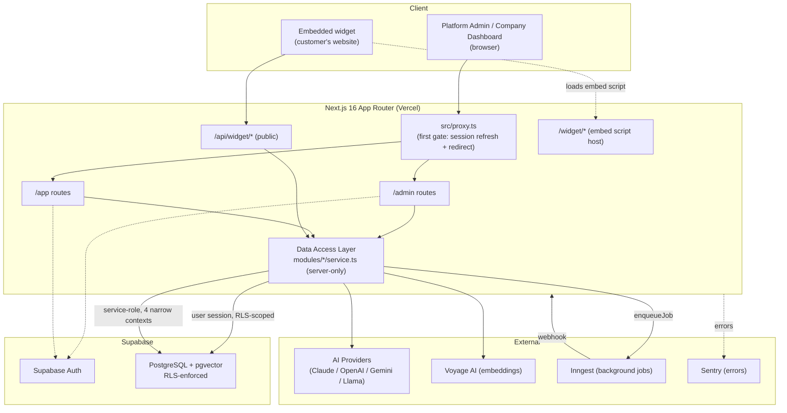
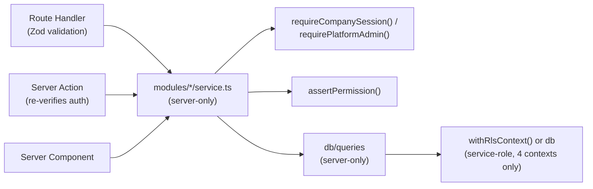
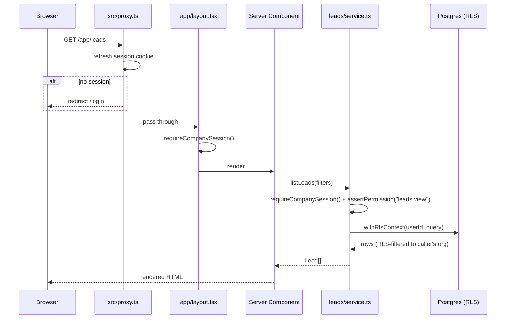
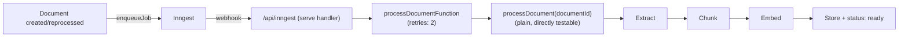

# Architecture

A **modular monolith**: one Next.js 16 (App Router) TypeScript codebase, no microservices, no Kubernetes, no Kafka, no event sourcing, no hand-rolled queue (`CLAUDE.md` §2). Three separate application surfaces share the same codebase and database, isolated by authentication model and, for tenant data, by Postgres RLS.

- [High-level architecture](#high-level-architecture)
- [Three surfaces](#three-surfaces)
- [Backend structure](#backend-structure)
- [Frontend structure](#frontend-structure)
- [Request lifecycle](#request-lifecycle)
- [Provider abstractions](#provider-abstractions)
- [Background jobs](#background-jobs)
- [Deep dives](#deep-dives)

## High-level architecture



## Three surfaces

| Surface | Route prefix | Auth | Tenancy |
|---|---|---|---|
| **Platform Admin** | `/admin` | Supabase session + `platform_admins` row | Cross-tenant by design (service-role, manually scoped per query) |
| **Company Dashboard** | `/app` | Supabase session + active `memberships` row | One organization per session, enforced by RLS |
| **Embedded Widget** | `/widget`, `/api/widget/*` | Public widget key only, no session | Resolved server-side from the key on every request |

See [`CLAUDE.md`](../../CLAUDE.md) §1 and §3 for why these are structurally separate rather than one role hierarchy.

## Backend structure

### Data Access Layer (DAL)

Next.js's own recommended pattern, adopted here: **database, service-role, and third-party API-key access live only in `modules/*/service.ts` and `db/queries`**, each marked `import "server-only"` at the top. Server Components and Server Actions call into this layer — they never hold a Supabase/Drizzle client or a secret directly.



A module's typical shape (only where Phase 1 actually needs each piece — no empty placeholder files, per `CLAUDE.md` §2):

```
modules/<name>/
  schema/           # if the module owns DB tables — re-exported from src/db/schema
  types.ts
  validation.ts     # Zod schemas
  service.ts        # the only place that touches db/queries or a vendor SDK
  <name>-service.ts # some modules split by sub-domain instead (e.g. leads/documents-service.ts)
```

### Module map

| Module | Owns |
|---|---|
| `organizations` | Companies, first-owner invite, team members |
| `permissions` | `can()`/`assertPermission()`, the role→permission map |
| `audit` | Append-only audit log writes |
| `knowledge` | Collections, documents, chunking, extraction, processing pipeline, semantic search |
| `ai-behaviour` | AI configuration, prompt generation, vendor prompt rendering |
| `widget` | Widget CRUD, appearance/behaviour, keys, domains, public config resolution |
| `conversation` | Execution pipeline, transport abstraction, memory/history, citations, usage |
| `leads` | Lead CRUD, stages, tags, notes, scoring, AI summaries, CSV export |
| `inbox` | Human takeover, reply, resume |
| `analytics` | 7 aggregation domains, alerts, dashboard preferences, export |
| `users` | Company user/team listing |

See [Backend](../backend/README.md) for the DAL pattern in more depth.

## Frontend structure

```
src/app/
  admin/          # Platform Admin surface — layout calls requirePlatformAdmin()
  app/            # Company Dashboard surface — layout calls requireCompanySession()
  auth/           # Login, invite confirmation, set-password
  api/            # Route Handlers (thin — validate, call service, map errors)
  widget/         # Public embed script host (if applicable) — see Widget docs
```

Shared UI: `src/components/ui/` (shadcn/ui primitives — Button, Card, Select, Tabs, etc., each carrying the app's cursor/loading/accessibility conventions), `src/shared/components/` (app-specific composites: `DashboardShell`, skeletons, `route-progress-bar`, `page-header`). Design tokens (typography scale, shadow scale) are defined via Tailwind v4 `@theme inline` in `globals.css`. See [Frontend](../frontend/README.md) for the full component system and design tokens.

## Request lifecycle

### Authenticated dashboard request (`/app/leads`)



### Public widget message (streamed)

See [AI → Conversation execution pipeline](../ai/README.md#conversation-execution-pipeline) for the full sequence diagram — key difference from the dashboard flow above: no session at all, access gated by public key + domain allowlist + rate limiting, and the response streams as Server-Sent Events instead of returning a single JSON body.

## Provider abstractions

Business modules never import a vendor SDK directly (`CLAUDE.md` §2) — every external dependency Phase 1 actually uses goes through a thin interface in `src/providers/`:

| Provider seam | Interface | Implementations |
|---|---|---|
| `providers/ai` | `AiProvider.streamChat()` | Claude, OpenAI, Gemini, Llama-compatible — see [AI → Providers](../ai/README.md#providers) |
| `providers/embeddings` | `EmbeddingProvider.generateEmbeddings()` | Voyage AI only |
| `providers/storage` | file upload/retrieval | Supabase Storage |
| `providers/jobs` | `enqueueJob(name, data)` | Inngest |

No interfaces exist yet for providers nothing calls in Phase 1 (WhatsApp, voice) — per `CLAUDE.md` §8, the schema leaves room (e.g. `leads.source`, `knowledge_collections` as a real table) without speculative interface code.

## Background jobs



Only one background function exists in Phase 1: knowledge document processing. See [Knowledge Base → Processing pipeline](../knowledge-base/README.md#processing-pipeline--status-flow).

## Deep dives

- [Database schema, ER diagram, RLS](../database/README.md)
- [Authentication](../authentication/README.md) · [Authorization](../authorization/README.md)
- [AI pipeline — providers, prompt assembly, retrieval, execution](../ai/README.md)
- [Knowledge Base — extraction, chunking, embeddings](../knowledge-base/README.md)
- [Widget — public resolution, embed SDK, security](../widget/README.md)
- [Platform Admin](./platform-admin.md) · [Company Management](./company-management.md)
- [API Reference](../api/README.md)
