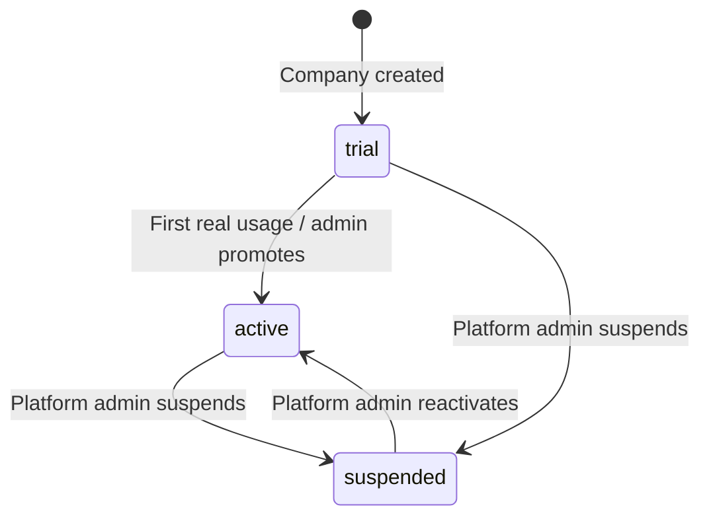

# Company Management

## Purpose

The platform-admin-side view and lifecycle management of a single company (organization) — distinct from the Company Dashboard (`/app`), which is what the company's own users see. This page covers `/admin/companies/[companyId]` and the underlying `modules/organizations` logic.

## Features

- Create a company (name, slug, website, industry, timezone)
- Edit company details
- Activate / suspend a company (`organizations.status`)
- Create the first owner (Supabase invite — see [Authentication](../authentication/README.md#invitations--supabase-owns-the-token-not-this-app))
- View the company's users and per-company audit log

## Roles

Platform-admin only — see [Platform Admin](./platform-admin.md#roles). No company-side role has any visibility into other companies' management data.

## Workflow

`organizations.status` drives access at both the application layer and RLS (`active_organization_ids()` excludes suspended orgs) — see [Authorization → Suspended organizations](../authorization/README.md#suspended-organizations).

## Permissions

Every write in `modules/organizations/service.ts` calls `requirePlatformAdmin()` independently and uses the **service-role** client — `organizations` has no RLS write policy for `authenticated`, so there is no RLS-scoped path for these operations at all. Slug uniqueness is checked explicitly before insert (`slug_taken` result), since it isn't enforced only by the DB unique constraint being surfaced as a friendly error.

## Screens

- `/admin/companies` — directory (name, slug, status)
- `/admin/companies/[companyId]` — Overview (details, status actions), Users, Audit Logs tabs

## Related APIs

Server Actions in `modules/organizations/service.ts`: `createCompany`, `updateCompany`, `updateCompanyStatus`, `createFirstOwner`, `listCompanies`, `listCompanyUsers`. Not exposed as public `/api` routes — see the [API Reference](../api/README.md) note on Platform Admin.

## Database tables

`organizations`, `memberships`, `audit_logs` — see [Database](../database/README.md#platform--tenancy).

Related: [Platform Admin](./platform-admin.md) · [Authentication — Invitations](../authentication/README.md#invitations--supabase-owns-the-token-not-this-app)
