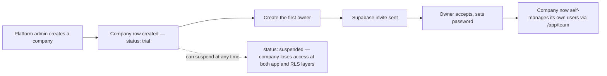

# Platform Admin

## Purpose

The SaaS owner's cross-tenant control surface — the only place that sees more than one organization at a time. Manages companies, provisions their first owner, and reviews platform-wide usage and audit data.

## Features

- Company directory: create, edit, activate/suspend
- Create the first owner for a company (Supabase invite — see [Authentication → Invitations](../authentication/README.md#invitations--supabase-owns-the-token-not-this-app))
- Per-company user list and per-company audit log
- Platform-wide user list and platform-wide audit log
- Usage overview

## Roles

Structurally separate from company roles — see [Authorization → Platform Admin](../authorization/README.md#platform-admin--structurally-separate). A row in `platform_admins` is the only requirement; there is no further role gradation within Platform Admin in Phase 1.

## Workflow

## Permissions

Every function in `modules/organizations/service.ts` for company CRUD calls `requirePlatformAdmin()` itself — `organizations` has no RLS write policy for the `authenticated` role at all, so these deliberately use the **service-role** client, not `withRlsContext`, and each one re-verifies platform-admin status independently rather than trusting a caller that already passed a layout check (`CLAUDE.md` §9).

## Screens

- `/admin` — overview stats, quick actions
- `/admin/companies` — company directory
- `/admin/companies/[companyId]` — company detail (Overview, Users, Audit Logs tabs)
- `/admin/users` — platform-wide user list
- `/admin/audit-logs` — platform-wide audit log
- `/admin/usage` — usage overview
- `/admin/settings` — platform settings

## Related APIs

Platform Admin currently operates through Server Actions/service calls rather than public `/api` routes documented in the [API Reference](../api/README.md) — see `modules/organizations/service.ts` and `modules/audit/service.ts`.

## Database tables

`organizations`, `platform_admins`, `memberships`, `audit_logs` — see [Database → Platform & tenancy](../database/README.md#platform--tenancy).

Related: [Company Management](./company-management.md) · [Audit Logs](../security/README.md#audit-logs)
