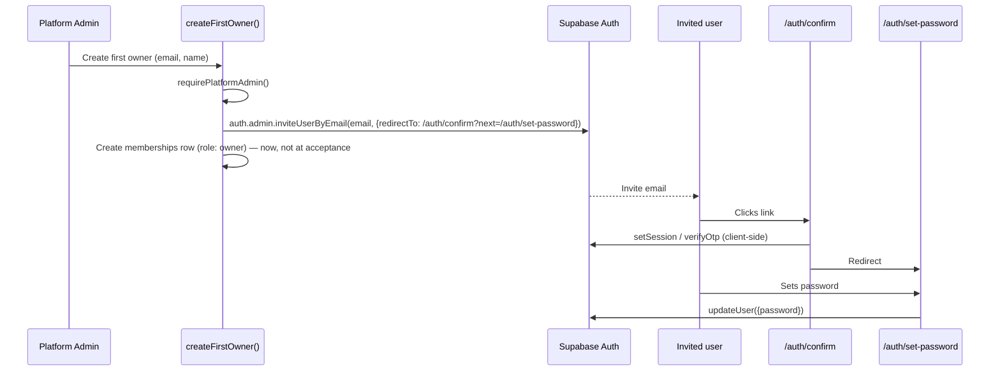

# Authentication

## Purpose

Identity and session management for both application surfaces (`/admin`, `/app`), built entirely on **Supabase Auth**. There is no separate auth system, no custom password storage, no custom token generation.

## Session resolution

`src/lib/auth/session.ts` — the only place a user's identity is trusted from:

- **`getAuthenticatedUser()`** — reads the verified Supabase session (`supabase.auth.getUser()`) for the current request. React-`cache`-wrapped so it resolves once per request regardless of how many call sites need it.
- **`getCompanySession()`** — resolves `{ userId, organizationId, organizationStatus, role }` from the user's **active** `memberships` row, looked up inside an RLS-scoped transaction (`withRlsContext`). Takes no organization id as input — there is nothing to trust from the client here. Returns `null` if the user has no active membership anywhere.
- **`requireCompanySession()`** — throws `"Unauthorized: no active company membership"` instead of returning `null`, for Server Actions/Route Handlers that should fail loudly rather than redirect (redirecting belongs at the page/layout level).
- **`isPlatformAdmin()` / `requirePlatformAdmin()`** (`src/lib/auth/platform-admin.ts`) — a structurally separate check against the `platform_admins` table via the **service-role client** (not `withRlsContext` — that table has zero RLS policies for `authenticated`, so an RLS-scoped query always returns nothing). See [Authorization → Platform Admin](../authorization/README.md#platform-admin--structurally-separate).

## Login

`/login` — email/password sign-in against Supabase Auth. On success, `getCompanySession()`/`isPlatformAdmin()` determine which surface the user lands on. A suspended organization's members see a dedicated notice rather than a generic error — see [Suspended organizations](../authorization/README.md#suspended-organizations).

## Invitations — Supabase owns the token, not this app

Per [`CLAUDE.md`](../../CLAUDE.md) §3.11: **the only way a company user is provisioned in Phase 1 is a platform-admin-triggered invite.** There is no public self-signup for the company side.

Key points:

- **`modules/organizations/service.ts` → `createFirstOwner()`**: calls `requirePlatformAdmin()`, then `supabase.auth.admin.inviteUserByEmail(email, { data: { full_name }, redirectTo: "${NEXT_PUBLIC_APP_URL}/auth/confirm?next=/auth/set-password" })`.
- **The `memberships` row is created at invite time** (by the admin action), **not at acceptance time** (by the user). This means re-visiting or retrying the acceptance step can't create a duplicate membership — there's nothing left for acceptance to create on the membership side.
- **This app never generates, stores, or validates the invite token.** Expiry, single-use consumption, and email/identity binding are entirely Supabase's responsibility. `/auth/confirm` only asks Supabase "is this token valid" and redirects — it holds no token state of its own.

### Why `/auth/confirm` must be client-rendered

`src/app/auth/confirm/confirm-client.tsx` (not a Route Handler) exists because which of two link formats Supabase actually sends depends on **project configuration**, not this app's code:

- `?token_hash=...&type=...` — server-visible query params.
- `#access_token=...&refresh_token=...` — an implicit-flow **hash fragment**, which by HTTP/URL spec a server never receives at all (fragments aren't sent in the request).

A server-only Route Handler can only ever see the first form and would silently fail on the second. The client component (`confirm-client.tsx`) handles both, via `setSession`/`verifyOtp`, before redirecting to `/auth/set-password`.

### Password acceptance

`src/app/auth/set-password/` — `set-password-form.tsx` + `actions.ts`. Establishes the session and calls Supabase `updateUser({ password })`. Does **not** touch `memberships` — that row already exists from invite time (see above).

## Route protection layers

See [Authorization → Enforcement layers](../authorization/README.md#enforcement-layers) for the full three-layer model (`src/proxy.ts` first gate → layout-level `require*Session()` → every Server Action/Route Handler re-checking itself). `src/proxy.ts` only refreshes the session cookie and redirects unauthenticated requests away from `/admin`/`/app` — it does not check role, org membership, or suspended status.

## Related

[Authorization](../authorization/README.md) · [Database — `memberships`](../database/README.md#memberships) · [Platform Admin module](../architecture/platform-admin.md)
