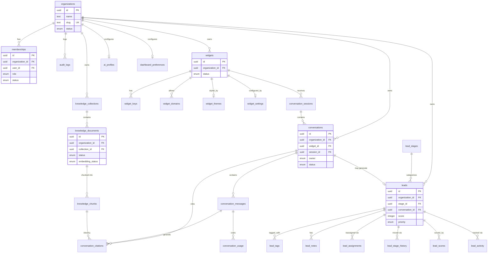

# Database

AI Lead Agent uses **PostgreSQL** (hosted on Supabase) with **[Drizzle ORM](https://orm.drizzle.team/)** for schema definition and migrations, and **pgvector** for embedding storage and similarity search. Multi-tenancy is enforced at two independent layers — application-level `organization_id` scoping and Postgres Row-Level Security — per [`CLAUDE.md`](../../CLAUDE.md) §3.

- [Entity-relationship diagram](#entity-relationship-diagram)
- [Table reference](#table-reference)
- [Enums](#enums)
- [Row-Level Security](./rls.md)
- [Migrations](./migrations.md)
- [Drizzle ORM structure](#drizzle-orm-structure)

## Drizzle ORM structure

- **Schema**: `src/db/schema/*.ts` — one file per table (33 tables across 34 files; `auth.ts` is a reference-only stub pointing at Supabase's managed `auth.users`, not a real owned table), aggregated in `src/db/schema/index.ts`.
- **Client**: `src/db/client.ts` — exports `db` (service-role Drizzle instance, RLS-bypassing — restricted per CLAUDE.md §3.6) and `withRlsContext(userId, callback)` (the default, RLS-respecting path for company/admin dashboard queries; runs `callback` inside a transaction with the Postgres session role switched to `authenticated` and `auth.uid()` resolving to `userId`).
- **Migrations**: `src/db/migrations/*.sql`, generated via `pnpm db:generate` (from schema diffs) and applied via `pnpm db:migrate`. Config: `drizzle.config.ts`.
- **Connection**: a single `postgres()` client capped at `max: 1` per instance (see [`operations/README.md`](../operations/README.md#connection-pooling) — this is a fix for a real production incident, not an arbitrary choice).

Every repository function that reads/writes tenant data takes an `organizationId` resolved server-side (never from client input) — see [`authorization/README.md`](../authorization/README.md).

## Entity-relationship diagram

*(Simplified for readability — every table also carries `organization_id`, `created_at`/`updated_at`; see the [full table reference](#table-reference) below for exact columns.)*

## Table reference

### Platform & tenancy

#### `organizations`
The tenant root. One row per company.

| Column | Type | Notes |
|---|---|---|
| `id` | uuid PK | |
| `name` | text NOT NULL | |
| `slug` | text NOT NULL UNIQUE | |
| `logo_url`, `website`, `industry` | text, nullable | |
| `timezone` | text NOT NULL, default `'UTC'` | |
| `status` | enum `organization_status` NOT NULL, default `'trial'` | `trial` \| `active` \| `suspended` |
| `created_at`, `updated_at` | timestamptz NOT NULL | |

#### `platform_admins`
Membership in this table (not a role) grants Platform Admin access — deliberately independent of `memberships` (see [`authorization/README.md`](../authorization/README.md)).

| Column | Type | Notes |
|---|---|---|
| `id` | uuid PK | |
| `user_id` | uuid NOT NULL UNIQUE, FK → `auth.users.id` ON DELETE CASCADE | |
| `created_at` | timestamptz NOT NULL | |

#### `memberships`
Links a Supabase Auth user to an organization with a role.

| Column | Type | Notes |
|---|---|---|
| `id` | uuid PK | |
| `organization_id` | uuid NOT NULL, FK → `organizations.id` CASCADE | |
| `user_id` | uuid NOT NULL, FK → `auth.users.id` CASCADE | |
| `role` | enum `membership_role` NOT NULL | `owner` \| `admin` \| `manager` \| `agent` \| `viewer` |
| `status` | enum `membership_status` NOT NULL, default `'invited'` | `invited` \| `active` \| `disabled` |
| `invited_by` | uuid, FK → `auth.users.id` SET NULL | |
| `created_at`, `updated_at` | timestamptz NOT NULL | |

**Indexes**: unique `(organization_id, user_id)`; partial unique `memberships_one_active_org_per_user` on `(user_id)` WHERE `status = 'active'` — enforces "one active organization per user" at the database level, not just in application code (see CLAUDE.md §3.10).

#### `audit_logs`
Append-only. No UPDATE/DELETE policy exists for `authenticated` — writes go through service-role code only.

| Column | Type | Notes |
|---|---|---|
| `id` | uuid PK | |
| `organization_id` | uuid, FK → `organizations.id` SET NULL | nullable — some platform-level events have no org |
| `actor_user_id` | uuid, FK → `auth.users.id` SET NULL | |
| `actor_type` | enum `audit_actor_type` NOT NULL | `platform_admin` \| `company_user` \| `system` |
| `action` | text NOT NULL | e.g. `company.owner_invited` |
| `resource_type`, `resource_id` | text | |
| `metadata` | jsonb NOT NULL, default `{}` | |
| `created_at` | timestamptz NOT NULL | |

**Indexes**: `(created_at desc)`, `(organization_id, created_at desc)`.

### Knowledge Base

See [`knowledge-base/README.md`](../knowledge-base/README.md) for the processing pipeline these tables support.

#### `knowledge_collections`
| Column | Type | Notes |
|---|---|---|
| `id` | uuid PK | |
| `organization_id` | uuid NOT NULL, FK CASCADE | |
| `name` | text NOT NULL | |
| `is_default` | boolean NOT NULL, default `false` | one default collection auto-created per org |
| `status` | enum `knowledge_collection_status` | `active` \| `archived` |
| `created_by` | uuid, FK SET NULL | |
| `deleted_at` | timestamptz, nullable | soft delete |

#### `knowledge_documents`
| Column | Type | Notes |
|---|---|---|
| `id` | uuid PK | |
| `organization_id`, `collection_id` | uuid NOT NULL, FK CASCADE | |
| `type` | enum `knowledge_document_type` NOT NULL | `pdf` \| `docx` \| `text` \| `website` |
| `title` | text NOT NULL | |
| `source_url`, `storage_path`, `source_text`, `checksum` | nullable | |
| `status` | enum `knowledge_document_status`, default `'pending'` | `pending` → `processing` → `ready` \| `failed`, or `archived` |
| `embedding_status` | enum `knowledge_embedding_status`, default `'pending'` | `pending` → `processing` → `ready` \| `failed` |
| `error_message` | text, nullable | |
| `chunk_count`, `token_count` | integer, default `0` | |
| `deleted_at` | timestamptz, nullable | soft delete |

**Indexes**: `(organization_id, collection_id)`; partial unique `(organization_id, checksum)` WHERE `checksum IS NOT NULL AND deleted_at IS NULL` — deduplicates re-uploads of identical content.

#### `knowledge_chunks`
| Column | Type | Notes |
|---|---|---|
| `id` | uuid PK | |
| `organization_id`, `collection_id`, `document_id` | uuid NOT NULL, FK CASCADE | denormalized onto every chunk for RLS/query convenience |
| `chunk_index` | integer NOT NULL | |
| `content` | text NOT NULL | |
| `char_count`, `token_count` | integer NOT NULL | |
| `embedding` | `vector(1024)` NOT NULL | pgvector — Voyage-3 embedding dimensions |

**Indexes**: `(document_id)`; HNSW index on `embedding` using `vector_cosine_ops` for fast approximate nearest-neighbor search.

#### `knowledge_search_logs`
Append-only (SELECT + INSERT policy only). `id`, `organization_id`, `actor_user_id`, `query`, `top_results` (jsonb), `result_count`, `latency_ms`, `created_at`.

### AI Behaviour

Singleton-per-organization tables (one row each) unless noted. See [`ai/README.md`](../ai/README.md).

| Table | Shape |
|---|---|
| `ai_profiles` | Singleton. `assistant_name`, `assistant_description`, `company_summary`, `role`, `personality_type` (enum), `custom_personality_description`, `response_style`, `communication_preferences`, `max_response_length` (default 500), `response_detail` (enum), `emoji_usage` (enum), `markdown_enabled`/`bullet_list_preference`/`ask_follow_up_questions`/`one_question_at_a_time`/`always_concise` (booleans), `primary_language`, `supported_languages` (jsonb), `auto_detect_language`, `fallback_language`, `safety_fallback_message`, `ai_provider` (enum: `openai`\|`claude`\|`gemini`\|`llama`) |
| `ai_business_rules` | Ordered list. `text`, `is_enabled`, `sort_order` |
| `ai_lead_questions` | Ordered list. `field_key`, `label`, `is_required`, `sort_order`, `placeholder`, `validation_type` (enum) |
| `ai_business_hours` | Singleton. `working_days` (jsonb), `start_time`, `end_time`, `timezone`, `holiday_mode`, `outside_hours_response` |
| `ai_handoff_settings` | Singleton. `escalation_enabled`, `escalation_email`, `escalation_message`, `manual_review_required`, `max_ai_attempts` (default 3) |

### Widget Platform

See [`widget/README.md`](../widget/README.md).

| Table | Shape |
|---|---|
| `widgets` | `name`, `description`, `status` (enum: `draft`\|`active`\|`disabled`\|`archived` — no hard delete), `default_language`, `created_by` |
| `widget_keys` | `public_key` (UNIQUE), `status` (`active`\|`revoked`). Partial unique index: one active key per widget at a time |
| `widget_domains` | `domain`, `is_enabled`. Unique `(widget_id, domain)` |
| `widget_themes` | One per widget. `primary_color`, `accent_color`, `launcher_position` (enum), `launcher_icon`, `border_radius`, `color_scheme` (enum), `font`, `logo_url`, `avatar_url`, `widget_width`/`widget_height` |
| `widget_settings` | One per widget. `welcome_message`, `suggested_questions` (jsonb), `show_typing_indicator`, `show_branding`, `offline_message`, `show_timestamp`, `show_powered_by`, `auto_open`, `auto_open_delay_seconds` |

### Conversation Engine

See [`ai/README.md#conversation-execution-pipeline`](../ai/README.md#conversation-execution-pipeline).

| Table | Shape |
|---|---|
| `conversation_sessions` | One per widget visitor. `visitor_id`, `status` (`active`\|`ended`), `metadata` (jsonb), timestamps. Unique `(widget_id, visitor_id)` |
| `conversations` | `status` (`active`\|`ended`), `owner` (`ai`\|`human`), `assigned_user_id`, `takeover_reason` (`manual`\|`automatic`), `takeover_at`, `last_read_at` |
| `conversation_messages` | `role` (`user`\|`assistant`\|`system`\|`tool`), `content`, `status` (`pending`\|`streaming`\|`complete`\|`error`), `provider`/`model` (plain text, not the enum — see below), `prompt_tokens`/`completion_tokens`/`latency_ms`, `error_message` |
| `conversation_citations` | Links a message to the knowledge chunk that grounded it. `similarity` (real), `confidence` (enum: `high`\|`medium`\|`low`) |
| `conversation_usage` | Per-message cost tracking. `provider`, `model`, token counts, `latency_ms`, `estimated_cost_usd` (numeric(12,6)) |

> **Why `provider`/`model` are plain `text`, not the `ai_provider` enum:** a historical record must never fail to insert just because a provider was later renamed or deprecated — see CLAUDE.md's general principle of not letting config changes corrupt historical data.

### Leads

See [`api/leads.md`](../api/leads.md).

| Table | Shape |
|---|---|
| `lead_stages` | Ordered pipeline. `name`, `sort_order`, `is_won`, `is_lost` |
| `leads` | `widget_id`, `conversation_id` (nullable — set if the lead came from a widget conversation), `stage_id` (FK **RESTRICT**, not CASCADE — a stage in use can't be deleted), `assigned_user_id`, `name`/`email`/`phone`/`company`/`location`, `source` (default `'widget'`), `priority` (enum), `score` (integer), `ai_summary` (jsonb, structured) |
| `lead_tags` | `tag`. Unique `(lead_id, tag)` |
| `lead_notes` | `content`, `author_user_id` — internal only, never visitor-visible |
| `lead_assignments` | Append-only audit trail of reassignments |
| `lead_stage_history` | Append-only audit trail of pipeline moves |
| `lead_scores` | Append-only. `signals` (jsonb), `total_score` |
| `lead_activity` | Append-only unified feed. `type` (enum, 11 values — see [enums](#enums)), `actor_user_id` (null = AI/system) |

### Analytics

| Table | Shape |
|---|---|
| `analytics_alert_rules` | `name`, `metric` (enum, 5 values), `operator` (`gt`\|`gte`\|`lt`\|`lte`), `threshold` (numeric), `enabled` |
| `dashboard_preferences` | Singleton per org. `cards` (jsonb: `{key, visible, sortOrder}[]`) |

## Enums

28 Postgres enums, one per `pgEnum` declaration:

| Enum | Values |
|---|---|
| `organization_status` | `trial`, `active`, `suspended` |
| `membership_role` | `owner`, `admin`, `manager`, `agent`, `viewer` |
| `membership_status` | `invited`, `active`, `disabled` |
| `audit_actor_type` | `platform_admin`, `company_user`, `system` |
| `knowledge_collection_status` | `active`, `archived` |
| `knowledge_document_type` | `pdf`, `docx`, `text`, `website` |
| `knowledge_document_status` | `pending`, `processing`, `ready`, `failed`, `archived` |
| `knowledge_embedding_status` | `pending`, `processing`, `ready`, `failed` |
| `ai_personality_type` | `professional`, `friendly`, `technical`, `luxury`, `healthcare`, `legal`, `sales`, `custom` |
| `ai_response_detail` | `concise`, `balanced`, `detailed` |
| `ai_emoji_usage` | `none`, `minimal`, `frequent` |
| `ai_provider` | `openai`, `claude`, `gemini`, `llama` |
| `ai_lead_question_validation` | `none`, `email`, `phone`, `number`, `text` |
| `widget_status` | `draft`, `active`, `disabled`, `archived` |
| `widget_key_status` | `active`, `revoked` |
| `widget_launcher_position` | `bottom-right`, `bottom-left`, `top-right`, `top-left` |
| `widget_color_scheme` | `light`, `dark`, `auto` |
| `conversation_session_status` | `active`, `ended` |
| `conversation_status` | `active`, `ended` |
| `conversation_owner` | `ai`, `human` |
| `conversation_takeover_reason` | `manual`, `automatic` |
| `conversation_message_role` | `user`, `assistant`, `system`, `tool` |
| `conversation_message_status` | `pending`, `streaming`, `complete`, `error` |
| `citation_confidence` | `high`, `medium`, `low` |
| `lead_priority` | `low`, `medium`, `high`, `urgent` |
| `lead_activity_type` | `lead_created`, `lead_updated`, `stage_changed`, `assigned`, `note_added`, `tag_added`, `tag_removed`, `summary_generated`, `score_updated`, `escalated`, `takeover_started`, `takeover_ended` |
| `analytics_alert_metric` | `failure_rate`, `avg_latency_ms`, `no_match_rate`, `escalation_rate`, `bounce_rate` |
| `analytics_alert_operator` | `gt`, `gte`, `lt`, `lte` |

## Foreign key overview

`organizations` is the central tenant node — nearly every table has `organization_id → organizations.id` (`ON DELETE CASCADE`, except `audit_logs` which is `SET NULL`, and `leads.widget_id`/`leads.conversation_id` which are `SET NULL`).

`auth.users` (Supabase-managed, external schema) is referenced by many tables (`memberships.user_id`, `*.created_by`, `*.actor_user_id`, `*.assigned_user_id`) — almost always `ON DELETE SET NULL`, except `memberships.user_id` and `platform_admins.user_id` (`ON DELETE CASCADE`).

The one `ON DELETE RESTRICT` foreign key in the schema is `leads.stage_id → lead_stages.id` — a pipeline stage that has leads in it cannot be deleted.

Next: [Row-Level Security →](./rls.md) · [Migrations →](./migrations.md)
