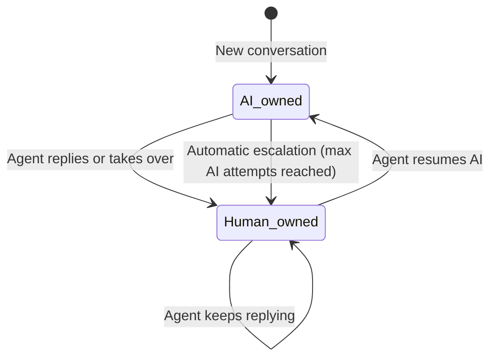

# Inbox (Human Takeover)

## Purpose

The agent-facing surface for taking a conversation away from the AI and replying as a human — either manually (an agent decides to step in) or automatically (the AI hits its configured attempt limit and escalates, per [AI Behaviour → handoff settings](../ai/README.md#ai-behaviour-module)).

## Features

- Filtered views: all, assigned to me, unassigned, unread, needs reply, escalated, closed
- Reply as a human (implicitly takes ownership if the AI still owned the conversation)
- Explicit takeover (without replying yet)
- Resume — hand the conversation back to the AI
- Mark read

## Roles

| Role | View | Reply/takeover/resume |
|---|:---:|:---:|
| `owner`, `admin`, `manager`, `agent` | ✅ | ✅ |
| `viewer` | ✅ | — |

Permissions: `inbox.view`, `inbox.reply`. Agents additionally only see conversations unassigned or assigned to them — see [Authorization → Agent-role restriction](../authorization/README.md#agent-role-restriction).

## Workflow

While `conversations.owner = "human"`, the [Conversation Engine execution pipeline](../ai/README.md#conversation-execution-pipeline) stores the visitor's messages but never auto-replies — it sends the widget a `{ type: "handoff" }` event instead. The widget SDK polls [`/api/widget/conversations/:id/messages`](../api/README.md#get-apiwidgetconversationsconversationidmessages) for new messages (including the agent's replies) while in this state.

## Screens

- `/app/inbox` — filtered conversation list
- `/app/inbox/[conversationId]` — transcript + reply composer + takeover/resume controls

## Related APIs

[Inbox endpoints](../api/README.md#inbox)

## Database tables

Shares `conversations`/`conversation_messages` with [Conversations](../conversations/README.md) — Inbox-specific columns: `conversations.owner`, `assigned_user_id`, `takeover_reason`, `takeover_at`, `last_read_at`. See [Database → Conversation Engine](../database/README.md#conversation-engine).

Related: [Conversations (Inspector)](../conversations/README.md) · [AI Behaviour — handoff settings](../ai/README.md#ai-behaviour-module) · [Leads](../api/leads.md) (a lead's `conversation_id` links back here)
