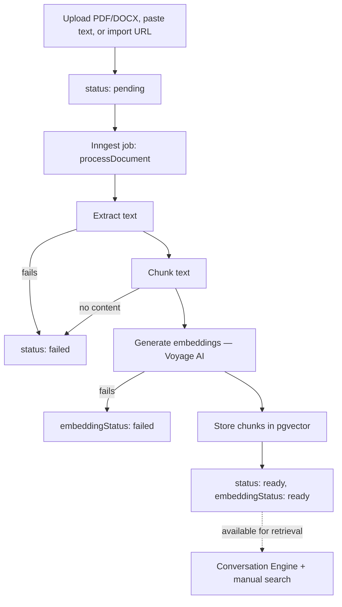

# Knowledge Base

## Purpose

Per-organization document store that grounds the AI assistant's answers. The assistant only answers company-specific questions from content that has been imported and processed here — see [AI → knowledge context](../ai/README.md#system-prompt-assembly) for how retrieval feeds into a reply, and [`CLAUDE.md`](../../CLAUDE.md) §5 for the platform rule that the AI must never invent facts not present in the knowledge base.

## Features

- Import via file upload (PDF, DOCX), website URL (single page), or pasted plain text
- Automatic background processing: extraction → chunking → embedding → ready
- Collections for organizing documents (every org gets one default collection)
- Manual semantic search from the dashboard
- Reprocess a failed or stale document on demand
- Archive / soft-delete (no permanent delete in Phase 1 — matches the "real asset" table convention, see [Database → RLS](../database/rls.md#policy-matrix-by-table-group))

## Roles

| Role | Access |
|---|---|
| `owner`, `admin`, `manager` (create/update) | Full management |
| `agent` | No access |
| `viewer` | View + search only |

Permissions: `knowledge.view`, `knowledge.create`, `knowledge.update`, `knowledge.delete`, `knowledge.search`, `knowledge.reprocess` (search and reprocess are distinct permissions from view/update — search triggers a paid embedding call, reprocess triggers a background job).

## Workflow

## Screens

`/app/knowledge-base` — collection/document list, upload dialog, search. `/app/knowledge-base/documents/[documentId]` — document detail: status, chunk/token counts, search stats, [reprocess/archive/delete actions](../api/README.md#knowledge-base).

## Related APIs

[Knowledge Base endpoints](../api/README.md#knowledge-base)

## Database tables

`knowledge_collections`, `knowledge_documents`, `knowledge_chunks`, `knowledge_search_logs` — see [Database → Knowledge Base](../database/README.md#knowledge-base).

---

## Document extraction

`src/modules/knowledge/extraction/` — one function per source type:

| Type | File | Library |
|---|---|---|
| PDF | `pdf.ts` | [`unpdf`](https://github.com/unjs/unpdf) — `extractText(pdf, { mergePages: true })` |
| DOCX | `docx.ts` | [`mammoth`](https://github.com/mwilliamson/mammoth.js) — `mammoth.extractRawText({ buffer })` |
| Website | `website.ts` | [`linkedom`](https://github.com/WebReflection/linkedom) (`parseHTML`) + [`@mozilla/readability`](https://github.com/mozilla/readability) — both imported **lazily** so they're never pulled into the module graph unless a website import actually runs |
| Plain text | handled inline in `processing-service.ts` (`document.sourceText`) — no library needed |

### Website import safety

`extractWebsiteText` (`src/modules/knowledge/extraction/website.ts`) imports exactly **one page**, no crawling:

- `assertSafeUrl` — an SSRF guard rejecting non-`http(s)` protocols and literal loopback/private-IP hostname patterns (`localhost`, `127.*`, `10.*`, `172.16–31.*`, `192.168.*`, `169.254.*` link-local/cloud-metadata, `::1`). **Documented limitation**: this does not protect against DNS rebinding — that requires a network-level control, not application code.
- `FETCH_TIMEOUT_MS = 15_000`, `MAX_HTML_SIZE_BYTES = 5MB` (checked via both `content-length` and actual body length).
- Requires `content-type` to include `text/html`.
- Parses with `linkedom` (no scripting engine — embedded `<script>` never executes) then runs `Readability.parse()` — the same technique Firefox Reader Mode uses — stripping nav/header/footer/script/style. Throws if Readability can't extract content.

Upload gating (`src/modules/knowledge/validation.ts`): `ALLOWED_UPLOAD_MIME_TYPES` = `application/pdf`, `application/vnd.openxmlformats-officedocument.wordprocessingml.document`; `MAX_UPLOAD_FILE_SIZE_BYTES = 20MB` — enforced server-side before anything touches storage, per `CLAUDE.md` §6.

## Chunking

`src/modules/knowledge/chunk-service.ts` → `chunkText(text): TextChunk[]`, pure function, no I/O. **Paragraph-boundary-first**, with sentence-boundary and hard-cut fallbacks — not a naive fixed-size splitter:

1. Normalize whitespace, split into paragraphs on blank lines.
2. Greedily pack paragraphs into a running buffer up to `TARGET_CHUNK_CHARS = 1500`.
3. A paragraph that alone exceeds the target is split at sentence boundaries (regex-based); a "sentence" that still exceeds the target (e.g. a long URL-heavy line) is hard-cut character by character.
4. **Overlap**: every chunk after the first is prefixed with the trailing `CHUNK_OVERLAP_CHARS = 200` of the previous chunk, so retrieval doesn't lose context at a chunk boundary.

Target size aims for ~300–400 tokens per chunk — a reasonable retrieval granularity, per the code's own comment. Token counts are metadata only (chunking itself is character-based), computed via `gpt-tokenizer`'s `countTokens` — the same package used to budget [conversation history](../ai/README.md#conversation-history-budget).

## Embeddings

`src/providers/embeddings/` — a single `EmbeddingProvider` interface (`generateEmbeddings(texts: string[]): Promise<number[][]>`, batched by design), one implementation: **Voyage AI** (`voyage.ts`), no fallback provider exists.

- Endpoint: `POST https://api.voyageai.com/v1/embeddings`, model `voyage-3`
- Dimension: **1024** (`EMBEDDING_DIMENSIONS`, defined alongside the `knowledge_chunks` schema) — requested explicitly via `output_dimension`. Changing the embedding model requires a DB migration, since the pgvector column width is fixed.
- `input_type: "document"` is always sent — the same code path handles both indexing-time and query-time embedding (there's no separate `"query"`-typed call).
- Batched up to `MAX_BATCH_SIZE = 128` texts per request; results are re-sorted by the API's returned `index` field before concatenation, guarding against out-of-order batch responses.
- Dimension is asserted after every call — a mismatched response throws rather than silently storing a malformed vector.

## Processing pipeline & status flow

`src/modules/knowledge/processing-service.ts` → `processDocument(documentId)`. Two independent status fields track progress:

- `status`: `pending` → `processing` → `ready` | `failed`, plus an independent terminal `archived` (set by user action, not the pipeline).
- `embeddingStatus`: `pending` → `processing` → `ready` | `failed` — a finer sub-status specifically for the embedding step. E.g. `status: "failed"` + `embeddingStatus: "pending"` means extraction never got far enough to embed; `status: "failed"` + `embeddingStatus: "failed"` means extraction succeeded but embedding failed.

Steps:

1. Load the document; bail out silently if soft-deleted.
2. Set `status: "processing"`, `embeddingStatus: "pending"`, clear any previous `errorMessage`.
3. Extract text (dispatch by `document.type`); on failure or empty output → `markFailed(..., "extraction")`.
4. Detect language (`franc-min`, best-effort/UI-only, never security-relevant) and chunk the text; zero chunks → failure.
5. Set `embeddingStatus: "processing"`; call `embeddingProvider.generateEmbeddings()`; on failure → `markFailed(..., "embedding")`.
6. **Atomically, in one transaction**: delete existing chunks for the document (no-op on first run; this is also the reprocessing code path), insert the new chunk rows, and update the document to `status: "ready"`, `embeddingStatus: "ready"` with final `chunkCount`/`tokenCount`/`language`.

### Background job wiring

Per `CLAUDE.md` §2 (no Redis/BullMQ — async work goes through the job-provider abstraction):

- `src/providers/jobs/client.ts` — the shared Inngest client (`id: "ai-lead-agent"`).
- `src/providers/jobs/index.ts` → `enqueueJob(name, data)` — the *only* way business modules trigger async work.
- `documents-service.ts` calls `enqueueJob(DOCUMENT_PROCESS_EVENT, { documentId })` after every upload/create/reprocess (`DOCUMENT_PROCESS_EVENT = "knowledge/document.process"`).
- `src/modules/knowledge/jobs.ts` — `processDocumentFunction`, thin Inngest glue (`retries: 2`) that extracts `documentId` from the event and calls `processDocument(documentId)`. `processDocument` itself is a plain, directly callable/testable function — it doesn't need live Inngest infrastructure to unit test.
- `src/app/api/inngest/route.ts` — registers the function via Inngest's Next.js `serve()` handler.
- **Reprocessing** (`requestReprocessDocument`) resets both status fields to `pending`, clears `errorMessage`, and re-enqueues the same event, reusing the same transactional delete-old/insert-new step.

## Semantic search

See [AI → Semantic search / retrieval](../ai/README.md#semantic-search--retrieval) for the full comparison between the manual dashboard search (`semanticSearch()`) and the Conversation Engine's retrieval call (`retrieveKnowledgeForConversation()`) — they share the same pgvector query shape but differ in auth model, result content, and logging.
